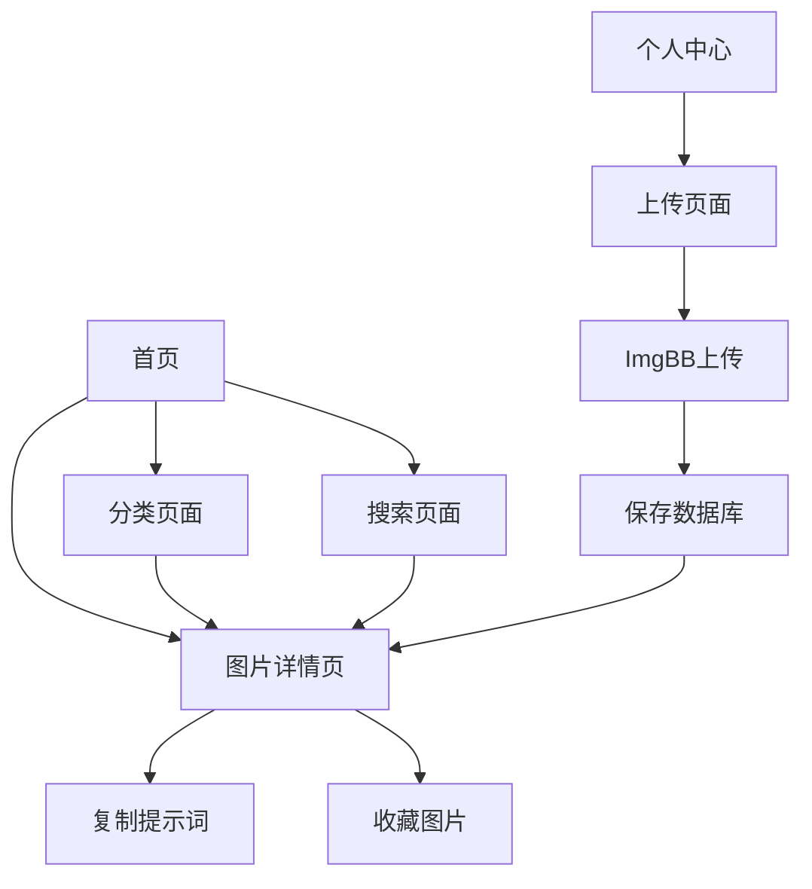

## 1. 产品概述
专业的图片提示词收藏网站，为AI绘画爱好者提供提示词管理和分享平台。用户可以上传、收藏、管理图片及其对应的AI绘画提示词，支持分类浏览和一键复制功能。

目标用户：AI绘画创作者、提示词收藏爱好者、设计师等创意工作者。

## 2. 核心功能

### 2.1 用户角色
| 角色 | 注册方式 | 核心权限 |
|------|----------|----------|
| 普通用户 | 邮箱注册 | 浏览图片、复制提示词、收藏图片 |
| 注册用户 | 邮箱验证 | 上传图片、管理个人收藏、编辑提示词 |
| 管理员 | 后台分配 | 管理分类、审核内容、用户管理 |

### 2.2 功能模块
图片提示词收藏网站包含以下核心页面：
1. **首页**：图片网格展示、分类筛选、搜索功能
2. **图片详情页**：高清图片展示、提示词详情、放大查看
3. **上传页面**：图片上传、提示词编辑、分类选择
4. **个人中心**：我的收藏、上传历史、个人设置
5. **分类页面**：分类浏览、标签云、统计信息
6. **登录注册页**：用户认证、密码重置

### 2.3 页面详情
| 页面名称 | 模块名称 | 功能描述 |
|----------|----------|----------|
| 首页 | 图片网格 | 响应式网格布局展示图片缩略图，支持瀑布流布局 |
| 首页 | 分类筛选 | 按一级/二级分类筛选图片，支持多选 |
| 首页 | 搜索栏 | 按关键词搜索图片标题和提示词内容 |
| 首页 | 复制功能 | 每张图片卡片提供一键复制提示词按钮 |
| 图片详情页 | 高清展示 | 完整展示高清图片，支持放大查看 |
| 图片详情页 | 提示词展示 | 显示完整提示词内容，关键词高亮 |
| 图片详情页 | 元数据 | 显示创建时间、作者、分类、浏览次数 |
| 图片详情页 | 交互功能 | 收藏、分享、举报功能 |
| 上传页面 | 图片上传 | 支持拖拽上传，ImgBB API集成，批量上传 |
| 上传页面 | 提示词编辑 | 富文本编辑器，支持版本历史 |
| 上传页面 | 分类选择 | 多级分类选择器，支持新建分类 |
| 上传页面 | 进度显示 | 实时显示上传进度和状态 |
| 个人中心 | 我的收藏 | 展示用户收藏的图片列表 |
| 个人中心 | 上传历史 | 展示用户上传的图片和管理入口 |
| 个人中心 | 个人设置 | 修改个人信息、密码、头像 |
| 分类页面 | 分类树 | 展示多级分类结构 |
| 分类页面 | 标签云 | 可视化展示热门标签 |
| 分类页面 | 统计信息 | 按分类统计图片数量 |

## 3. 核心流程

### 用户浏览流程
用户进入首页 → 浏览图片网格 → 点击分类筛选 → 选择图片 → 查看详情 → 复制提示词 → 收藏图片

### 用户上传流程
用户登录 → 进入上传页面 → 拖拽图片 → 填写提示词 → 选择分类 → 提交上传 → 等待处理 → 上传成功

### 分类管理流程
管理员登录 → 进入分类管理 → 创建一级分类 → 创建二级分类 → 设置分类属性 → 保存生效

## 4. 用户界面设计

### 4.1 设计风格
- **主色调**：深空蓝(#1a1a2e)搭配亮紫色(#8b5cf6)
- **辅助色**：渐变色彩，营造科技感
- **按钮样式**：圆角矩形，悬停动效
- **字体**：思源黑体，标题18-24px，正文14-16px
- **布局风格**：卡片式网格布局，响应式设计
- **图标风格**：线性图标，简洁现代

### 4.2 页面设计概览
| 页面名称 | 模块名称 | UI元素 |
|----------|----------|----------|
| 首页 | 导航栏 | 左侧logo，中间搜索框，右侧用户菜单，深色背景 |
| 首页 | 分类侧边栏 | 左侧抽屉式，树形结构，支持展开收起 |
| 首页 | 图片网格 | 瀑布流布局，卡片悬停阴影，加载动画 |
| 首页 | 复制按钮 | 悬浮在图片右下角，点击动效，成功提示 |
| 图片详情页 | 图片展示区 | 居中显示，支持鼠标滚轮放大，背景遮罩 |
| 图片详情页 | 提示词区域 | 可折叠面板，语法高亮，一键复制按钮 |
| 图片详情页 | 元数据栏 | 图标+文字形式，信息分类展示 |
| 上传页面 | 上传区域 | 虚线框拖拽区域，支持多文件，进度条 |
| 上传页面 | 编辑器 | 富文本编辑器，工具栏，实时预览 |
| 个人中心 | 标签页 | 顶部导航标签，内容区域切换 |

### 4.3 响应式设计
- **桌面优先**：1440px基准设计
- **平板适配**：768px-1439px，网格自适应
- **手机适配**：320px-767px，单列布局
- **触摸优化**：移动端增大点击区域，支持手势操作