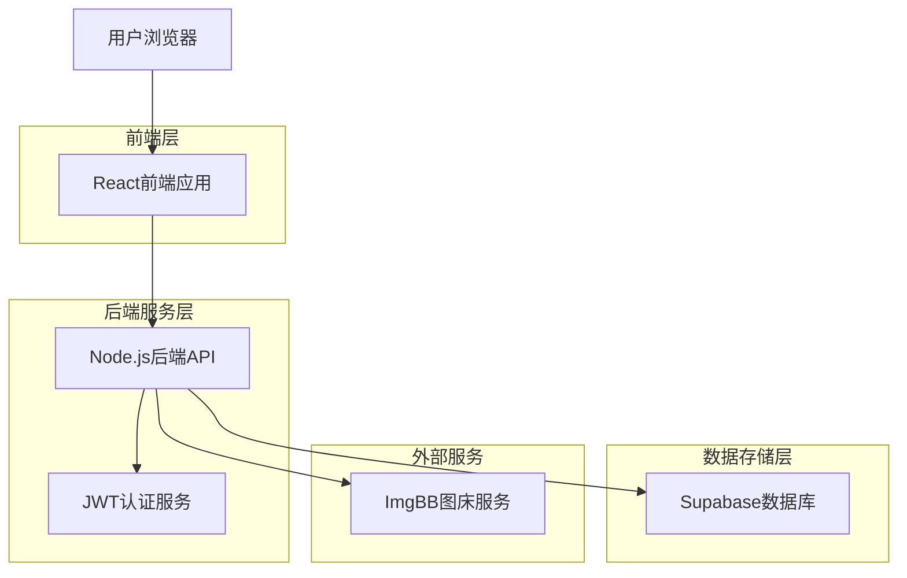
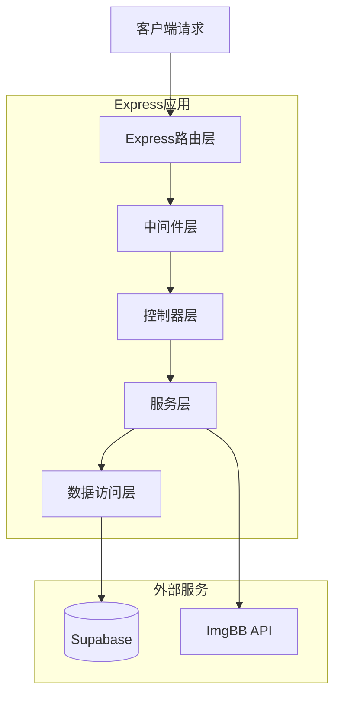
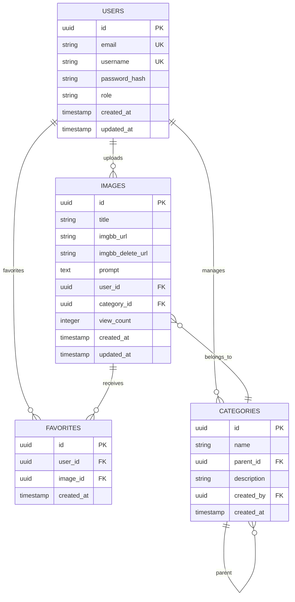

## 1. 架构设计



## 2. 技术描述

* **前端**：React\@18 + TypeScript + Tailwind CSS\@3 + Vite

* **初始化工具**：vite-init

* **后端**：Node.js\@18 + Express\@4 + TypeScript

* **数据库**：Supabase (PostgreSQL)

* **认证**：JWT + Supabase Auth

* **文件上传**：Multer + ImgBB API

* **状态管理**：Zustand

* **UI组件库**：Ant Design\@5

## 3. 路由定义

| 路由                | 用途        |
| ----------------- | --------- |
| /                 | 首页，图片网格展示 |
| /login            | 登录页面      |
| /register         | 注册页面      |
| /image/:id        | 图片详情页     |
| /upload           | 图片上传页面    |
| /profile          | 个人中心      |
| /category/:id     | 分类页面      |
| /search           | 搜索结果页     |
| /admin/categories | 分类管理（管理员） |

## 4. API定义

### 4.1 用户认证API

**用户注册**

```
POST /api/auth/register
```

请求参数：

| 参数名      | 类型     | 必填 | 描述     |
| -------- | ------ | -- | ------ |
| email    | string | 是  | 用户邮箱   |
| password | string | 是  | 密码（加密） |
| username | string | 是  | 用户名    |

响应：

| 参数名   | 类型     | 描述    |
| ----- | ------ | ----- |
| token | string | JWT令牌 |
| user  | object | 用户信息  |

**用户登录**

```
POST /api/auth/login
```

请求参数：

| 参数名      | 类型     | 必填 | 描述   |
| -------- | ------ | -- | ---- |
| email    | string | 是  | 用户邮箱 |
| password | string | 是  | 密码   |

### 4.2 图片管理API

**获取图片列表**

```
GET /api/images
```

查询参数：

| 参数名      | 类型     | 必填 | 描述        |
| -------- | ------ | -- | --------- |
| page     | number | 否  | 页码，默认1    |
| limit    | number | 否  | 每页数量，默认20 |
| category | string | 否  | 分类ID      |
| search   | string | 否  | 搜索关键词     |

**上传图片**

```
POST /api/images/upload
```

请求参数：

| 参数名          | 类型     | 必填 | 描述    |
| ------------ | ------ | -- | ----- |
| image        | file   | 是  | 图片文件  |
| prompt       | string | 是  | 提示词内容 |
| category\_id | string | 是  | 分类ID  |
| tags         | array  | 否  | 标签数组  |

**获取图片详情**

```
GET /api/images/:id
```

### 4.3 分类管理API

**获取分类树**

```
GET /api/categories
```

**创建分类**

```
POST /api/categories
```

请求参数：

| 参数名         | 类型     | 必填 | 描述    |
| ----------- | ------ | -- | ----- |
| name        | string | 是  | 分类名称  |
| parent\_id  | string | 否  | 父分类ID |
| description | string | 否  | 分类描述  |

## 5. 服务器架构图



## 6. 数据模型

### 6.1 数据模型定义



### 6.2 数据定义语言

**用户表 (users)**

```sql
-- 创建用户表
CREATE TABLE users (
    id UUID PRIMARY KEY DEFAULT gen_random_uuid(),
    email VARCHAR(255) UNIQUE NOT NULL,
    username VARCHAR(50) UNIQUE NOT NULL,
    password_hash VARCHAR(255) NOT NULL,
    role VARCHAR(20) DEFAULT 'user' CHECK (role IN ('user', 'admin')),
    avatar_url VARCHAR(500),
    created_at TIMESTAMP WITH TIME ZONE DEFAULT NOW(),
    updated_at TIMESTAMP WITH TIME ZONE DEFAULT NOW()
);

-- 创建索引
CREATE INDEX idx_users_email ON users(email);
CREATE INDEX idx_users_username ON users(username);
```

**图片表 (images)**

```sql
-- 创建图片表
CREATE TABLE images (
    id UUID PRIMARY KEY DEFAULT gen_random_uuid(),
    title VARCHAR(255) NOT NULL,
    imgbb_url VARCHAR(500) NOT NULL,
    imgbb_delete_url VARCHAR(500) NOT NULL,
    prompt TEXT NOT NULL,
    user_id UUID NOT NULL REFERENCES users(id) ON DELETE CASCADE,
    category_id UUID REFERENCES categories(id) ON DELETE SET NULL,
    view_count INTEGER DEFAULT 0,
    created_at TIMESTAMP WITH TIME ZONE DEFAULT NOW(),
    updated_at TIMESTAMP WITH TIME ZONE DEFAULT NOW()
);

-- 创建索引
CREATE INDEX idx_images_user_id ON images(user_id);
CREATE INDEX idx_images_category_id ON images(category_id);
CREATE INDEX idx_images_created_at ON images(created_at DESC);
```

**分类表 (categories)**

```sql
-- 创建分类表
CREATE TABLE categories (
    id UUID PRIMARY KEY DEFAULT gen_random_uuid(),
    name VARCHAR(100) NOT NULL,
    parent_id UUID REFERENCES categories(id) ON DELETE CASCADE,
    description TEXT,
    created_by UUID REFERENCES users(id) ON DELETE SET NULL,
    created_at TIMESTAMP WITH TIME ZONE DEFAULT NOW(),
    UNIQUE(name, parent_id)
);

-- 创建索引
CREATE INDEX idx_categories_parent_id ON categories(parent_id);
```

**收藏表 (favorites)**

```sql
-- 创建收藏表
CREATE TABLE favorites (
    id UUID PRIMARY KEY DEFAULT gen_random_uuid(),
    user_id UUID NOT NULL REFERENCES users(id) ON DELETE CASCADE,
    image_id UUID NOT NULL REFERENCES images(id) ON DELETE CASCADE,
    created_at TIMESTAMP WITH TIME ZONE DEFAULT NOW(),
    UNIQUE(user_id, image_id)
);

-- 创建索引
CREATE INDEX idx_favorites_user_id ON favorites(user_id);
CREATE INDEX idx_favorites_image_id ON favorites(image_id);
```

### 6.3 Supabase权限设置

```sql
-- 授予基本权限
GRANT SELECT ON users TO anon;
GRANT SELECT ON images TO anon;
GRANT SELECT ON categories TO anon;

-- 授予认证用户完整权限
GRANT ALL PRIVILEGES ON users TO authenticated;
GRANT ALL PRIVILEGES ON images TO authenticated;
GRANT ALL PRIVILEGES ON categories TO authenticated;
GRANT ALL PRIVILEGES ON favorites TO authenticated;

-- 创建行级安全策略
ALTER TABLE images ENABLE ROW LEVEL SECURITY;
ALTER TABLE favorites ENABLE ROW LEVEL SECURITY;

-- 图片访问策略
CREATE POLICY "Public images are viewable by everyone" ON images
    FOR SELECT USING (true);

CREATE POLICY "Users can insert their own images" ON images
    FOR INSERT WITH CHECK (auth.uid() = user_id);

CREATE POLICY "Users can update their own images" ON images
    FOR UPDATE USING (auth.uid() = user_id);

CREATE POLICY "Users can delete their own images" ON images
    FOR DELETE USING (auth.uid() = user_id);
```

